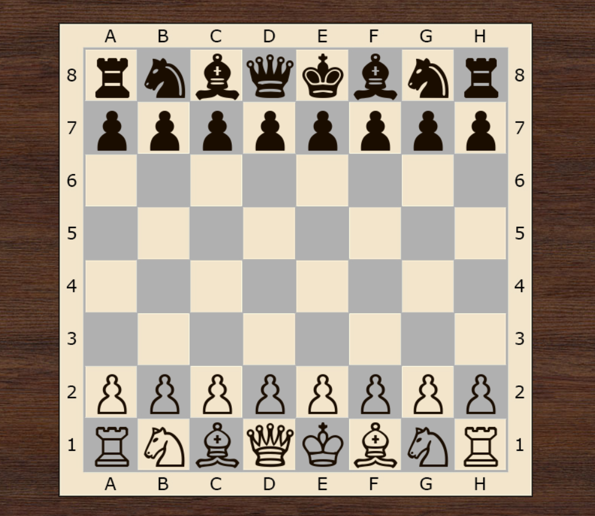
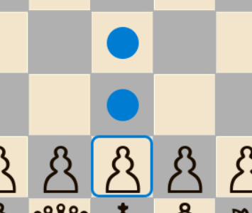
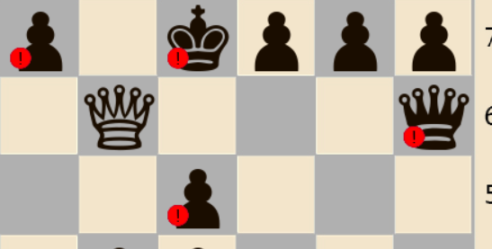
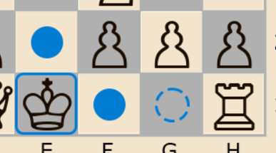
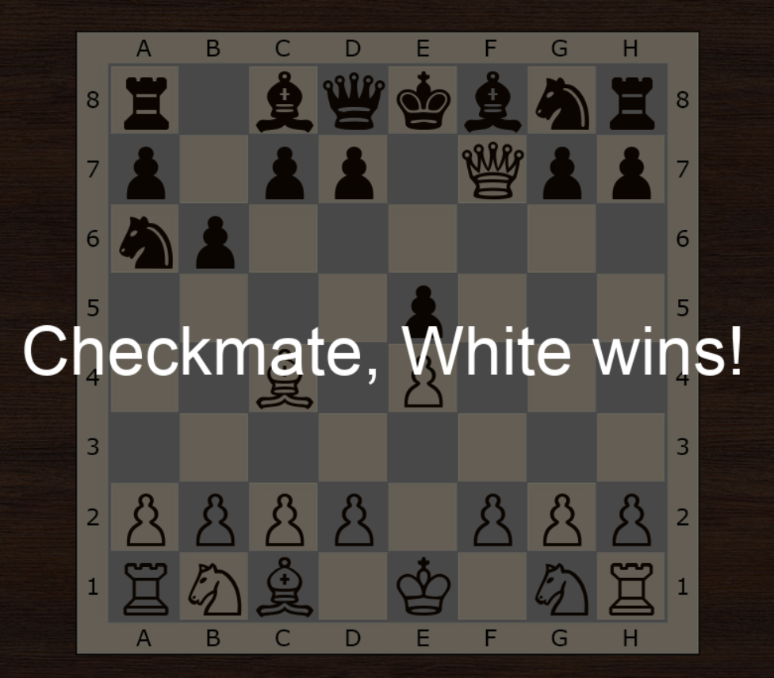
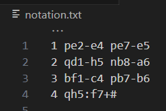

# Графическая реализация шахмат на Python с использованием PyGame.
*Разработано совместно с [Strawlll](https://github.com/Strawlll "Павел Калинин")*

## Описание
Данная работа является лабораторкой по дисциплине "Практикум по программированию" на 1 курсе обучения в университете

Задачей было создать приложение для игры в шахматы, используя принципы ООП

Каждая фигура является объектом собственного класса, наследуемого от `Figure`: `Pawn, Rook, Knight, Bishop, Queen, King`

Объект каждого из классов имеет обязательные свойства `name, x, y, color, icon`

Для класса пешки `Pawn` есть так же свойство - счётчик ходов, необходимый для реализации движения на 2 клетки, если фигура до этого не двигалась и взятия на проходе

Изначальное задание подразумевало лишь консольное приложение, но было решено изучить библиотеку PyGame для отображения графического интерфейса, иначе игра была бы слишком скучной.

## Внешний вид приложения
#### Общий вид

#### Подсказки ходов

#### Предупреждения 

#### Рокировка

#### Завершение игры

#### Автоматическая нотация 

*Для запуска необходима библиотека pygame*

`pip install pygame`
